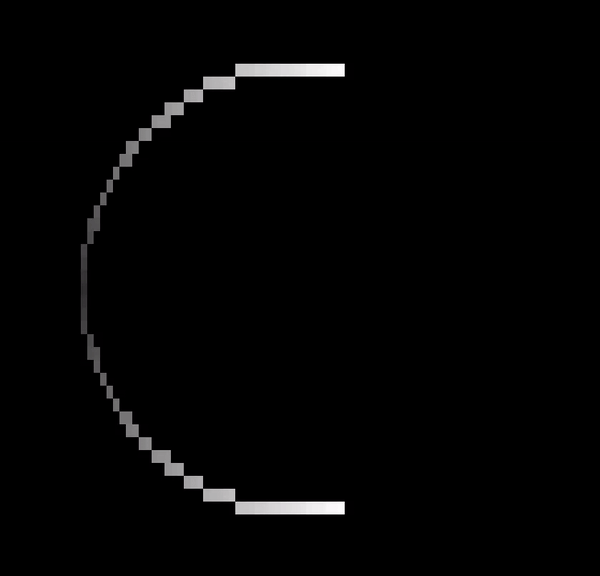

# kinet

Kinetic Art displayed on terminal using ncurses.

<p align="center">
	
</p>


## Todo

- [x] Dynamic size update based on window size
- [x] User parameter to define the trial angle
- [ ] Arrow key binding to change the rate of animation
- [ ] Arrow key binding to change direction of travel => clockwise and anticlockwise
- [x] User parameter to set the background and foreground color
- [ ] Default background and foreground color set to same as terminal color theme [ref](https://github.com/htop-dev/htop/tree/main)
  - 20.04, gnome-terminal - gsettings list-recursively org.gnome.Terminal.Legacy.Profile:/org/gnome/terminal/legacy/profiles/
  - 20.04, gnome-terminal - cd ~/.config/dconf/ && dconf dump / > dconf_settings.txt && cat dconf_settings.txt
  - 20.04, terminator - cat ~/.config/terminator/config
  - How to access colors? => use terminfo database, term.h, getcap, tgetent => method that returns terminal capabilities,

## Usage

**Installation**

Install from apt

```
wget -O - https://raw.githubusercontent.com/maker-ATOM/apt-repo/master/public.key | sudo apt-key add -

echo "deb https://maker-atom.github.io/apt-repo stable main" | sudo tee /etc/apt/sources.list.d/maker-ATOM.list

sudo apt update
```

```
sudo apt install kinet
```

**OR**

Build from source

```py
git clone git@github.com:maker-ATOM/kinet.git
```
```py
cd kinet
cmake -B build
cmake --build build
```

To install the file so that it can be executable from anywhere while being in the terminal,

```
cd build
make
sudo make install
```


**Execution**

```
kinet # With default trail angle of 120 degrees, Background color - Black(0,0,0), Foreground color - White(255,255,255)
```

```
kinet -t 90 -b 255,0,0 -f 0,0,255 # Parameters set to trail angle 90 degrees, Background color - Red(255,0,0), Foreground color - Blue(0,0,255)
```

**Parameters**

```
-t degrees   Trail angle in degrees ranging from 0 to 180
-b r,g,b     RGB color for background ranging from 0 to 255
-f r,g,b     RGB color for foreground ranging from 0 to 255

```

### Dependencies
ncurses, CMake